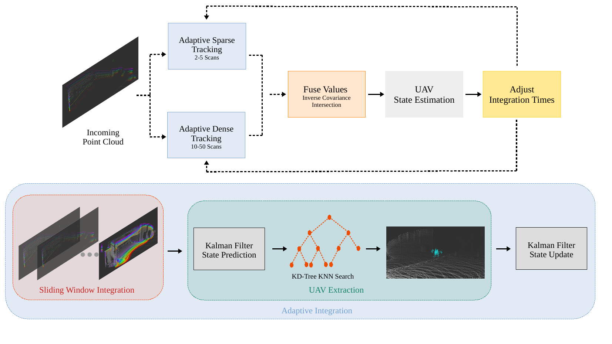

## **Note**: A new real-time implementation of the code is available at [https://github.com/IacopomC/dynamic_scan_tracking](https://github.com/IacopomC/dynamic_scan_tracking)


<div align="center">
    <h1>UAV Tracking with Solid-State Lidars: Dynamic Multi-Frequency Scan Integration</h1>
    <a href="https://github.com/TIERS/dynamic_scan_tracking/blob/main/LICENSE"></a>
    <a href="https://github.com/TIERS/dynamic_scan_tracking/blob/main"></a>
    <a href="https://github.com/TIERS/dynamic_scan_tracking/blob/main"></a>
    <a href="https://github.com/TIERS/dynamic_scan_tracking/blob/main"></a>
    <br />
    <br />
    <a href="https://tiers.github.io/dynamic_scan_tracking/">Project Page</a>
    <span>&nbsp;&nbsp;•&nbsp;&nbsp;</span>
    <a href="https://arxiv.org/pdf/2304.12125.pdf">Paper</a>
    <span>&nbsp;&nbsp;•&nbsp;&nbsp;</span>
    <a href="https://github.com/TIERS/dynamic_scan_tracking/issues">Contact Us</a>
  <br />
  <br />
  <p align="center">
    
  </p>

</div>

This is the code implementation for the paper [UAV Tracking with Solid-State Lidars: Dynamic Multi-Frequency Scan Integration](https://arxiv.org/abs/2304.12125).

<hr />

## Install
The code has been tested on Ubuntu 20.04 with ROS Noetic

### Dependencies
- PCL

- Eigen

- Boost

- Livox_ros_driver, Follow [livox_ros_driver Installation](https://github.com/Livox-SDK/livox_ros_driver).

The drone detection requires the point cloud to be in PointCloud2 format while the tracking uses the Livox CustomMsg data type. For the conversion use [this](https://github.com/koide3/livox_to_pointcloud2) repository and follow the instructions. If you use a different repository, change the value for the ```self.lidar_sub``` variable in the ```livox_to_img.py``` file accordingly.

### Build
```
  cd ~/catkin_ws/src
  git clone https://github.com/TIERS/dynamic_scan_tracking
  cd ..
  catkin build
  ```

## Run
  ```
  roslaunch dynamic_scan_tracking dynamic_scan_tracking.launch
  ```

To enable/disable the drone detection modify the parameters in the ```config.yaml``` file.

## Citation
If you use this code for any academic work, please cite the following publication:

```
@misc{catalano2023uav,
    title={UAV Tracking with Solid-State Lidars:Dynamic Multi-Frequency Scan Integration}, 
    author={Iacopo Catalano and Ha Sier and Xianjia Yu and Jorge Pena Queralta and Tomi Westerlund},
    year={2023},
    eprint={2304.12125},
    archivePrefix={arXiv},
    primaryClass={cs.RO}
}
```
